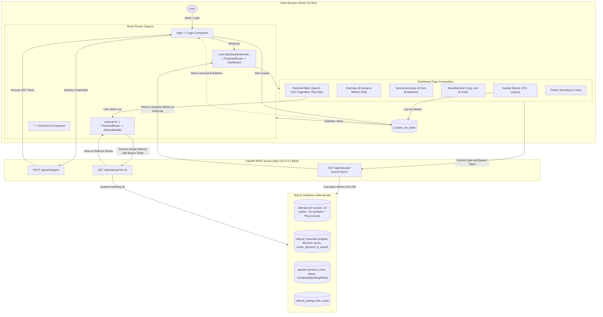

# Comprehensive Technical & Architectural Documentation
## Project: Referral Dashboard (`frontend-referral-dashboard`)

---

## 1. Executive Summary

The **Referral Dashboard** is a production-grade, full-stack web application built with a **React 19** single-page frontend, a **FastAPI** Python REST backend, and an embedded **SQLite** relational database. Originally configured with an external third-party API that expired, the application has been re-architected to an integrated, locally hosted FastAPI backend.

The platform serves as an affiliate and partner referral portal that calculates **all eight overview metrics and active referral counts** dynamically from stored financial records, bank payouts, and referral data using exact `Decimal` arithmetic.

> [!NOTE]
> **Synthetic Demo Data Disclaimer**: Financial inputs and payouts are synthetic sample data. Dashboard values are calculated from SQLite using project-defined demo formulas. No real financial transactions occur.

### Key Details & Metadata
- **Project Name:** `referral-dashboard`
- **Application Type:** Full-Stack Web Application (SPA Frontend + REST API Backend)
- **Frontend Framework:** React 19, React Router v7, Vanilla CSS3
- **Backend Framework:** FastAPI, Uvicorn, SQLite3, PyJWT, Argon2 (`pwdlib`)
- **Default Portals:**
  - Frontend: `http://localhost:3000`
  - Backend API: `http://127.0.0.1:8000`
  - Interactive OpenAPI Docs: `http://127.0.0.1:8000/docs`

---

## 2. Technology Stack & Dependencies

### Frontend (`package.json`)
| Category | Technology / Library | Version | Purpose |
| :--- | :--- | :--- | :--- |
| **Core Framework** | React | `^19.2.7` | UI component library & virtual DOM rendering |
| **DOM Renderer** | React DOM | `^19.2.7` | Mounting React components into browser DOM |
| **Routing** | React Router DOM | `^7.18.0` | Client-side routing, protected navigation, parameter parsing |
| **State & Cookie Management** | `js-cookie` | `^3.0.8` | Client-side cookie reading, writing, and deletion for JWT tokens |
| **Iconography** | `react-icons` (`fa` FontAwesome) | `^5.6.0` | Vector icons for metrics dashboard overview cards |
| **Build & Scripts** | `react-scripts` (Create React App) | `5.0.1` | Webpack build orchestration, Babel transpilation, Dev server |
| **Styling** | Vanilla CSS3 | Custom per component | Flexbox, CSS Grid, responsive design, micro-interactions |

### Backend (`requirements.txt` / Python Environment)
| Category | Technology / Library | Purpose |
| :--- | :--- | :--- |
| **API Framework** | FastAPI | High-performance asynchronous REST API framework |
| **ASGI Server** | Uvicorn | High-throughput ASGI server |
| **Database** | SQLite3 | Embedded ACID-compliant relational SQL database |
| **Precision Math** | Python `decimal.Decimal` | Exact decimal arithmetic for financial cents conversion |
| **Authentication** | PyJWT | JSON Web Token encoding, decoding, and verification |
| **Password Hashing** | Pwdlib + Argon2 | Modern secure password hashing and verification |
| **Configuration** | Python-dotenv | Environment variable loading from `.env` files |

---

## 3. Architecture & Data Flow Diagram



---

## 4. Complete File & Folder Reference

This section provides complete details of every file and folder in the project.

### 4.1. Workspace Root Files
- **`package.json`**: Root configuration for the React application. Specifies runtime dependencies (`react`, `react-dom`, `react-router-dom`, `js-cookie`, `react-icons`), development dependencies (`react-scripts`), and script hooks (`start`, `build`, `test`, `eject`).
- **`package-lock.json`**: Deterministic dependency lockfile generated by npm, pinning exact sub-dependency versions and checksums across installations.
- **`requirements.txt`**: Specifies backend Python dependencies: `fastapi`, `uvicorn`, `PyJWT`, `pwdlib[argon2]`, and `python-dotenv`.
- **`.env`**: Frontend environment configuration file containing `REACT_APP_API_BASE_URL=http://127.0.0.1:8000`. Used by Axios / fetch calls in React components.
- **`.gitignore`**: Git exclusion rules covering `node_modules/`, `build/`, `.venv/`, `.env`, `backend/.env`, `__pycache__/`, and OS artifacts.
- **`README.md`**: Public-facing overview, setup instructions, architectural specs, metric formulas, testing commands, and troubleshooting guides.
- **`project_overall_now.md`**: This document—the comprehensive engineering reference and architectural specification for the entire repository.
- **`vercel.json`**: Vercel SPA routing configuration specifying rewrites (`{"rewrites": [{"source": "/(.*)", "destination": "/index.html"}]}`) to route all direct URL visits and page reloads cleanly through React Router without 404s.

---

### 4.2. `public/` Directory
Static assets and base HTML templates served by Create React App:
- **`public/index.html`**: Root HTML page containing standard metadata, viewport tags, the `<div id="root"></div>` mounting container, and Google Font link tags for typography.
- **`public/manifest.json`**: Web app manifest providing PWA metadata (application name, start URL, display theme colors, and icons).
- **`public/favicon.ico`**: Standard browser tab icon.
- **`public/logo192.png`**: 192×192 PNG application icon for home-screen shortcuts.
- **`public/logo512.png`**: 512×512 PNG high-resolution splash icon.
- **`public/robots.txt`**: Crawler instructions for search engines.

---

### 4.3. `src/` Root Directory
The core frontend application source files:
- **`src/index.js`**: React application entry point. Imports React 19 `createRoot` from `react-dom/client`, wraps `<App />` inside React strict mode, and mounts it into the `#root` element.
- **`src/index.css`**: Global stylesheet containing CSS resets, box-sizing defaults, font family hierarchy, and CSS custom property color variables.
- **`src/App.js`**: Root router component using React Router v7. Configures routes:
  - `/login`: Public login view.
  - `/` and `/dashboard/referrals`: Wrapped in `<ProtectedRoute>`, renders the `Dashboard` component.
  - `/referral/:id`: Wrapped in `<ProtectedRoute>`, renders `ReferralDetails`.
  - `*`: Fallback route rendering `NotFound`.
- **`src/App.css`**: Base application wrapper styles.
- **`src/App.test.js`**: Standard smoke test verifying that the root App component renders cleanly.
- **`src/setupTests.js`**: Configures custom Jest matchers using `@testing-library/jest-dom`.
- **`src/reportWebVitals.js`**: Performance monitoring utility measuring Core Web Vitals (FID, FCP, LCP, CLS, TTFB).
- **`src/logo.svg`**: Vector graphic asset.

---

### 4.4. `src/components/` Directory
Reusable modular components that compose the dashboard interface:

#### 1. `src/components/Navbar/`
- **`index.js`**: Top navigation bar component.
  - Displays the GoBusiness branding logo and platform navigation links.
  - Provides an action button and an interactive **Log Out** button.
  - Handlers: `handleLogout()` clears the `jwt_token` cookie via `Cookies.remove('jwt_token')` and navigates the user back to `/login`.
  - Preserved exactly as required without changes.
- **`index.css`**: Flexbox navigation styling, sticky/fixed header positioning, hover state transitions, and responsive mobile adjustments.

#### 2. `src/components/Footer/`
- **`index.js`**: Page footer displaying company info, product links, and copyright text. Preserved without changes.
- **`index.css`**: Dark background styling, footer link column grid, and typography styling.

#### 3. `src/components/Overview/`
- **`index.js`**: Metrics overview grid component.
  - Receives `metrics` array from `Dashboard` state.
  - Renders **eight distinct cards** in order:
    1. Total Balance (`FaWallet`)
    2. Discount Percentage (`FaPercentage`)
    3. Total Referral (`FaUsers`)
    4. Discount Amount (`FaTag`)
    5. Commission Amount (`FaHandHoldingUsd`)
    6. Total Earning (`FaCoins`)
    7. Commission Discount (`FaFunnelDollar`)
    8. Total Bank Transfer (`FaUniversity`)
  - Formats numbers, labels, and icon backgrounds with distinct accent palettes.
- **`index.css`**: Responsive CSS grid (`grid-template-columns: repeat(auto-fit, minmax(220px, 1fr))`), rounded borders (`border-radius: 12px`), drop shadows, and badge styling.

#### 4. `src/components/ServiceSummary/`
- **`index.js`**: Renders the 4 summary cards:
  - **Service**: Joined list of active service categories.
  - **Your Referrals**: Total referrals count (`52`).
  - **Active Referrals**: Count of active referrals (`42`).
  - **Total Ref Earnings**: Total net earned commission (`$10,023,300.00`).
- **`index.css`**: Grid/flex styling with clean card borders and typography hierarchy.

#### 5. `src/components/ShareReferral/`
- **`index.js`**: Referral sharing widget.
  - Displays read-only input fields for the Referral Link (`https://gobusiness.com/?referral=ABCXYZ`) and Referral Code (`ABCXYZ`).
  - Implements clipboard copying via `navigator.clipboard.writeText()` with visual "Copied!" feedback state.
- **`index.css`**: Input field layout with attached copy action buttons and subtle hover transitions.

#### 6. `src/components/ReferralsTable/`
- **`index.js`**: Core data table component with full client-side controls.
  - **Live Search**: Case-insensitive filtering across referral `name` and `serviceName`.
  - **Date Sorting**: Toggle between `Newest first` (descending) and `Oldest first` (ascending).
  - **Pagination**: 10 records per page (52 total records = 6 pages), with page index buttons, Previous/Next navigation, and boundary controls.
  - **Auto-Reset**: Search query or sort order changes automatically reset current page index to 1.
  - **Row Navigation**: Clicking any referral row navigates the browser to `/referral/:id`.
  - **Independence**: Table filtering and pagination affect displayed table rows only; global overview metrics remain stable.
- **`index.css`**: Data table styles, zebra striping, search bar flex layout, select dropdowns, clickable row hover highlights, and pagination controls.

#### 7. `src/components/ProtectedRoute/`
- **`index.js`**: Route security wrapper.
  - Inspects client cookie `Cookies.get('jwt_token')`.
  - If a valid token exists, renders child components via `<Outlet />`.
  - If missing or empty, renders `<Navigate to="/login" replace />`.

---

### 4.5. `src/pages/` Directory
High-level page views composed of components:

#### 1. `src/pages/Dashboard/`
- **`index.js`**: Primary authenticated dashboard view.
  - On mount, calls `GET /api/referrals` with the `Bearer <token>` authorization header.
  - Manages `metrics`, `serviceSummary`, `referral` share settings, and `referrals` table data states.
  - Handles loading spinner states and error banners.
  - Renders `Navbar`, `Overview`, `ServiceSummary`, `ShareReferral`, `ReferralsTable`, and `Footer`.
- **`index.css`**: Page container layout, background color (`#f8fafc`), section gutters, and spacing.

#### 2. `src/pages/Login/`
- **`index.js`**: Authentication page view.
  - Controlled inputs for email and password.
  - Submits to `POST /api/auth/signin`.
  - On success: saves token via `Cookies.set('jwt_token', token, { expires: 1/24 })` and redirects to `/`.
  - On error: displays alert message.
  - Auto-redirect: If user is already authenticated, redirects directly to `/`.
  - Design matched to reference screenshot: Soft background (`#f4f6fc`), purple brand theme, purple submit button.
- **`index.css`**: Centered card layout, responsive form inputs, purple button states, and error alerts.

#### 3. `src/pages/ReferralDetails/`
- **`index.js`**: Dedicated inspection page for individual referrals (`/referral/:id`).
  - Extracts `:id` parameter from URL via `useParams()`.
  - Fetches single record via `GET /api/referrals?id=:id`.
  - Renders top back link ("← Back to Dashboard"), header with partner name and service badge pill, detail attributes grid (Referral ID, Date, Service, Net Commission).
  - If backend returns 404 or referral is not found, dynamically renders the `NotFound` component.
  - Design matched to reference screenshot: `#f4f6fc` background, `#eff2fe` service badge pill with `#5850ec` text, uppercase field labels, bold values.
- **`index.css`**: Details card styling, responsive 2-column layout, badge styling, and typography.

#### 4. `src/pages/NotFound/`
- **`index.js`**: Error 404 page.
  - Clean, focused interface displaying bold `404`, "Page not found" title, descriptive message, and "Back to dashboard" button routing to `/`.
  - Matched directly to the reference 404 design.
- **`index.css`**: Full viewport centered card styling, light gray backdrop, typography, and action button.

---

### 4.6. `backend/` Directory
The Python FastAPI backend service:

- **`backend/main.py`**:
  - Initializes FastAPI application with metadata and description.
  - Configures `CORSMiddleware` supporting dynamic `FRONTEND_ORIGINS` (comma-separated origins from environment) alongside development localhost defaults (`http://localhost:3000`, `http://127.0.0.1:3000`).
  - Implements shared database path configuration via `DATABASE_PATH` environment variable (defaults to `backend/referrals.db`).
  - Implements Argon2 password verification via `pwdlib` and JWT token creation/decoding via `PyJWT`.
  - Loads configuration (`JWT_SECRET`, `DEMO_EMAIL`, `DEMO_PASSWORD`, `FRONTEND_ORIGINS`, `DATABASE_PATH`) from `.env` or system environment.
  - **`GET /health`** & **`GET /api/health`**: Returns `{"status": "ok"}` for deployment liveness probes, monitoring, and Render health checks.
  - **`POST /api/auth/signin`**: Validates user credentials, returns signed JWT token.
  - **`GET /api/referrals`**: Protected endpoint requiring `Bearer <token>`.
    - Queries `referrals`, `referral_financials`, `payouts`, and `referral_settings` from SQLite.
    - Computes all eight overview metrics dynamically using exact `Decimal` arithmetic on integer cents.
    - Applies `search` and `sort` query filters exclusively to table row items, preserving global metrics.
    - Handles single `id` lookup for the referral details view, returning 404 if record doesn't exist.
    - Implements fallback to `"N/A"` for dependent metrics if unmapped referrals exist in the database.
- **`backend/seed.py`**:
  - Database initialization and migration script.
  - Respects the shared `DATABASE_PATH` environment variable.
  - Creates four relational tables: `referrals`, `referral_financials`, `payouts`, `referral_settings`.
  - Uses `INSERT OR IGNORE` to safely insert 52 referrals (10 visible reference records, 40 synthetic records, 2 restored records: Priya and Arun), 52 financial rows, and 5 payouts.
  - Guarantees idempotency: running repeatedly will not duplicate rows or overwrite existing user edits.
- **`backend/start.sh`**:
  - Production deployment startup script.
  - Uses `set -e` to fail immediately on any errors.
  - Executes `python backend/seed.py` to ensure schema and seed data exist prior to starting the web server.
  - Starts Uvicorn ASGI server binding to `0.0.0.0` on port `"${PORT:-8000}"`.
- **`backend/referrals.db`**:
  - The SQLite database file containing all 52 referrals, financial cents, payout transactions, and settings.
- **`backend/.env`**:
  - Local environment configuration specifying `JWT_SECRET`, `DEMO_EMAIL`, and `DEMO_PASSWORD`.
- **`backend/.env.example`**:
  - Template environment file documenting all necessary backend variables, including `FRONTEND_ORIGINS` and `DATABASE_PATH`.

---

### 4.7. `tests/` Directory
Automated test suite located directly in the repository root:

- **`tests/test_dashboard.py`**:
  - Fully self-contained Python test script runnable from the repository root (`python tests/test_dashboard.py`).
  - **Suite 1: Isolated Database & Calculation Fixture Tests**:
    - Creates an in-memory temporary SQLite database.
    - Verifies Net Commission identity: $\text{Gross} - \text{Discount} = \text{Profit}$ exact down to the cent.
    - Verifies Balance identity: $\text{Balance} + \text{Completed Transfers} = \text{Total Earnings}$.
    - Verifies Payout status exclusions (pending and failed payouts excluded from transfers and balance).
    - Verifies weighted aggregate percentage calculation ($21.2\%$ vs flawed simple row average $21.7\%$).
    - Verifies active referral counts ($2$ of $3$).
    - Verifies insert-only seeding idempotency and preservation of existing user edits.
    - Verifies fallback to `"N/A"` when custom unmapped referrals are introduced.
  - **Suite 2: Live Backend API Integration Tests**:
    - Authenticates against the running FastAPI server (`POST /api/auth/signin`).
    - Fetches live referrals payload (`GET /api/referrals`).
    - Verifies all 8 overview metrics and 4 service summary values.
    - Verifies filter independence (search queries filter rows while leaving global metrics intact).
    - Verifies single ID lookup (`GET /api/referrals?id=ref-051` resolves Priya).

---

## 5. Database Schema & Data Model

All monetary amounts in `referral_financials` and `payouts` are stored as **integer cents** to eliminate floating-point imprecision.

```sql
-- Referrals Table (52 records)
CREATE TABLE IF NOT EXISTS referrals (
    id TEXT PRIMARY KEY,
    name TEXT NOT NULL,
    serviceName TEXT NOT NULL,
    date TEXT NOT NULL,
    profit REAL NOT NULL,
    is_synthetic INTEGER DEFAULT 0
);

-- Referral Financials Table (Linked 1:1 with referrals.id)
CREATE TABLE IF NOT EXISTS referral_financials (
    referral_id TEXT UNIQUE PRIMARY KEY,
    original_amount_cents INTEGER NOT NULL,
    discount_amount_cents INTEGER NOT NULL,
    gross_commission_cents INTEGER NOT NULL,
    commission_discount_cents INTEGER NOT NULL,
    is_active INTEGER NOT NULL DEFAULT 1,
    FOREIGN KEY (referral_id) REFERENCES referrals (id)
);

-- Payouts Table (5 sample transactions)
CREATE TABLE IF NOT EXISTS payouts (
    id TEXT PRIMARY KEY,
    amount_cents INTEGER NOT NULL,
    status TEXT NOT NULL, -- 'completed', 'pending', or 'failed'
    paid_at TEXT          -- Timestamp for completed payouts
);

-- Referral Sharing Settings Table
CREATE TABLE IF NOT EXISTS referral_settings (
    id INTEGER PRIMARY KEY,
    link TEXT NOT NULL,
    code TEXT NOT NULL
);
```

---

## 6. Mathematical Formulas & Business Rules

### A. Net Commission Identity
For every referral record:
$$\text{Existing Profit (Net Commission)} = \text{gross\_commission} - \text{commission\_discount}$$
$$\text{gross\_commission\_cents} - \text{commission\_discount\_cents} = \text{int}(\text{Decimal}(\text{profit}) \times 100)$$

Constraints maintained:
- $\text{discount\_amount\_cents} \le \text{original\_amount\_cents}$
- $\text{commission\_discount\_cents} \le \text{gross\_commission\_cents}$
- $\sum \text{completed\_payouts\_cents} \le \sum \text{profit\_cents}$

### B. Overview Metrics Formulas
1. **Total Balance**:
   $$\text{Total Balance} = \sum \text{net earned commission} - \sum \text{completed payouts}$$
   $$\text{Total Balance} = \text{Total Earning} - \text{Total Bank Transfer}$$
2. **Discount Percentage** (Weighted aggregate percentage, not row averages):
   $$\text{Discount Percentage} = \frac{\sum \text{discount\_amount\_cents}}{\sum \text{original\_amount\_cents}} \times 100$$
   *(Evaluates to $0.0\%$ if original amount denominator is $0$)*
3. **Total Referral**:
   $$\text{Total Referral} = \text{COUNT}(*) \text{ of referrals table}$$
4. **Discount Amount**:
   $$\text{Discount Amount} = \sum \text{discount\_amount\_cents} / 100$$
5. **Commission Amount**:
   $$\text{Commission Amount} = \sum \text{gross\_commission\_cents} / 100$$
6. **Total Earning**:
   $$\text{Total Earning} = \sum \text{profit (net earned commission)}$$
7. **Commission Discount** (Weighted aggregate percentage, not row averages):
   $$\text{Commission Discount} = \frac{\sum \text{commission\_discount\_cents}}{\sum \text{gross\_commission\_cents}} \times 100$$
   *(Evaluates to $0.0\%$ if gross commission denominator is $0$)*
8. **Total Bank Transfer**:
   $$\text{Total Bank Transfer} = \sum \text{amount\_cents WHERE status} = \text{'completed'} / 100$$
   *(Pending and failed payouts are explicitly excluded)*

### C. Service Summary Formulas
- **service**: Derived by joining all distinct stored service names in the referrals table.
- **yourReferrals**: Total referral count across the dataset for this single-account demo.
- **activeReferrals**: Count of referrals where $\text{is\_active} = 1$.
- **totalRefEarnings**: Total net earned commission ($\sum \text{profit}$).

### D. Missing Financial Inputs Fallback
If any custom referral in the `referrals` table lacks a corresponding record in `referral_financials`, dependent metrics (**Discount Percentage**, **Discount Amount**, **Commission Amount**, **Commission Discount**, **Active Referrals**) return `"N/A"` rather than silently miscalculating missing inputs as zero. Non-dependent measures (**Total Referral**, **Total Earning**, **Total Bank Transfer**, **Total Balance**, **service**, **yourReferrals**, **totalRefEarnings**) continue to compute accurately.

---

## 7. Actual Calculated Results Report

Across the full 52-record sample dataset (`ref-001` to `ref-052`):

| Measure / Metric | Calculated Value | Formula & Source |
| :--- | :--- | :--- |
| **1. Total Balance** | `$4,023,300.00` | Net Commission ($10,023,300.00) − Completed Payouts ($6,000,000.00) |
| **2. Discount Percentage** | `22.4%` | Total Discount ($15,735,460.19) / Total Original ($70,302,300.00) × 100 |
| **3. Total Referral** | `52` | `COUNT(*)` across stored referrals |
| **4. Discount Amount** | `$15,735,460.19` | `SUM(discount_amount_cents)` |
| **5. Commission Amount** | `$11,703,918.50` | `SUM(gross_commission_cents)` |
| **6. Total Earning** | `$10,023,300.00` | `SUM(profit)` across all 52 referrals |
| **7. Commission Discount** | `14.4%` | Total Comm. Discount ($1,680,618.50) / Gross Comm. ($11,703,918.50) × 100 |
| **8. Total Bank Transfer** | `$6,000,000.00` | Completed payouts (`payout-001`, `payout-002`, `payout-003`) |
| **Service Summary: service** | `B2B, Backend, Cloud Hosting, DevOps, Frontend, Fullstack, Graphics, HR, PM, QA, UI/UX, Web Development` | Joined distinct stored service names |
| **Service Summary: yourReferrals** | `52` | Total referrals count |
| **Service Summary: activeReferrals** | `42` | Count where `is_active = 1` (42 active, 10 inactive) |
| **Service Summary: totalRefEarnings** | `$10,023,300.00` | Total net earned commission |

Mathematical balance verified:
- $\text{Total Balance (\$4,023,300.00)} + \text{Total Bank Transfer (\$6,000,000.00)} = \text{Total Earning (\$10,023,300.00)}$
- $\text{Commission Amount (\$11,703,918.50)} - \text{Commission Discount (\$1,680,618.50)} = \text{Total Earning (\$10,023,300.00)}$

---

## 8. Dataset Breakdown (52 Predefined Records)

| Category | ID Range | Count | Description |
| :--- | :--- | :--- | :--- |
| **Visible Reference Records** | `ref-001` to `ref-010` | 10 | Geeta, Vinod, Rekha, Ashok, Sonal, Mohit, Anjali, Srinivas, Harish, Moumita (Page 1 in newest first order) |
| **Synthetic Demo Records** | `ref-011` to `ref-050` | 40 | Synthetic records with older dates (`2012-09-28` to `2010-11-15`) populating Pages 2 to 6 |
| **Restored Demo Records** | `ref-051`, `ref-052` | 2 | Priya (`Web Development`, `2026-10-08`, profit `250.0`) and Arun (`Cloud Hosting`, `2026-10-07`, profit `150.0`) |

### Sample Payouts Catalog
| Payout ID | Amount (USD) | Amount (Cents) | Status | Paid At | Effect on Totals |
| :--- | :--- | :--- | :--- | :--- | :--- |
| `payout-001` | `$2,500,000.00` | `250000000` | `completed` | `2026-08-15 10:00:00` | Included in transfers & balance |
| `payout-002` | `$1,500,000.00` | `150000000` | `completed` | `2026-09-01 14:30:00` | Included in transfers & balance |
| `payout-003` | `$2,000,000.00` | `200000000` | `completed` | `2026-09-20 09:15:00` | Included in transfers & balance |
| `payout-004` | `$750,000.00` | `75000000` | `pending` | `None` | **Excluded** |
| `payout-005` | `$500,000.00` | `50000000` | `failed` | `None` | **Excluded** |

---

## 9. How to Run the Entire Project

All commands work directly from the repository root:

### 1. Database Seeding & Migration
```bash
python backend/seed.py
```
*(On Windows: `& .venv/Scripts/python.exe backend/seed.py`)*

### 2. Start the FastAPI Backend Server
```bash
python -m uvicorn backend.main:app --reload --port 8000
```
*(On Windows: `& .venv/Scripts/python.exe -m uvicorn backend.main:app --reload --port 8000`)*
- API Endpoint: `http://127.0.0.1:8000`
- Interactive OpenAPI Docs: `http://127.0.0.1:8000/docs`

### 3. Start the React Frontend Server
```bash
npm start
```
- Web Application: `http://localhost:3000`

### 4. Run Automated Financial & Calculations Tests
```bash
python tests/test_dashboard.py
```
*(On Windows: `& .venv/Scripts/python.exe tests/test_dashboard.py`)*

### 5. Build for Production
```bash
npm run build
```

---

## 10. Production Deployment (Render + Vercel)

### A. Backend on Render
1. Create a **Web Service** connecting to the GitHub repository.
2. Settings:
   - **Environment**: Python 3
   - **Root Directory**: repository root (`.`)
   - **Build Command**: `pip install -r requirements.txt`
   - **Start Command**: `bash backend/start.sh`
   - **Health Check Path**: `/health`
3. Environment Variables:
   - `JWT_SECRET`: Secure random string
   - `DEMO_EMAIL`: Demo account email
   - `DEMO_PASSWORD`: Demo account password
   - `FRONTEND_ORIGINS`: Comma-separated allowed frontend domains (e.g. `https://frontend-referral-dashboard.vercel.app`)
   - `DATABASE_PATH`: `backend/referrals.db` (or `/var/data/referrals.db` with a Persistent Disk)

### B. Frontend on Vercel
1. Import repository into Vercel.
2. Settings:
   - **Framework Preset**: Create React App
   - **Root Directory**: `./`
   - **Build Command**: `npm run build`
   - **Output Directory**: `build`
3. Environment Variables:
   - `REACT_APP_API_BASE_URL`: Deployed backend URL (e.g. `https://your-backend.onrender.com`), without trailing slash.
4. Client-Side SPA Rewrites:
   - Automatically handled by [vercel.json](file:///d:/prabha/Github_Prabha2005/frontend-referral-dashboard/vercel.json) to redirect all client routes to `/index.html`.

---

## 11. Responsive CSS Design, Breakpoints & Accessibility

### A. Changed CSS Files & Enhancements
| File | Changes & Responsiveness Role |
| :--- | :--- |
| **`src/index.css`** | Universal `box-sizing: border-box`, `overflow-x: hidden` on `html`/`body` to prevent page blowout, `:focus-visible` ring defaults, `@media (prefers-reduced-motion: reduce)` reset. |
| **`src/pages/Dashboard/index.css`** | Responsive container padding (`32px` desktop, `20px` tablet, `16px` phone), font clamping for page headings, accessible status container and error banners. |
| **`src/components/Overview/index.css`** | Responsive 4/2/1 column CSS Grid, `clamp(17px, 2vw, 22px)` value typography, `overflow-wrap: anywhere` and `word-break: break-word` to prevent digit clipping on large currency values. |
| **`src/components/ServiceSummary/index.css`** | Responsive 4/2/1 column grid, multi-line wrapping and fluid font sizing for lengthy joined service lists. |
| **`src/components/ShareReferral/index.css`** | 2-column desktop to 1-column mobile stacking, input text-overflow ellipsis, fixed-width touch-friendly copy buttons (42px height, 82px min-width). |
| **`src/components/ReferralsTable/index.css`** | Contained horizontal table scrolling via `-webkit-overflow-scrolling: touch` with `min-width: 520px`, responsive stacked search/sort controls, wrapped touch pagination buttons. |
| **`src/pages/Login/index.css`** | Fluid card padding (`36px` desktop down to `24px` on narrow phones), touch-friendly 44px inputs and submit button, focus rings, wrapped alert messages. |
| **`src/pages/ReferralDetails/index.css`** | Responsive detail card, wrapped partner names and service badges, vertical attribute stacking on screens `≤768px`. |
| **`src/pages/NotFound/index.css`** | Centered layout with responsive padding, fluid font sizes, and focus-visible back button. |
| **`src/components/Navbar/index.css`** | Preserved original colors and visual design; added `≤480px` media query to scale padding and button sizes, eliminating horizontal overflow on 320px devices. |
| **`src/components/Footer/index.css`** | Preserved original design; reduced mobile side padding from 60px to 16px to prevent viewport blowout. |

### B. Responsive Breakpoints Matrix
| Viewport Tier | Width Tested | Layout Behavior |
| :--- | :--- | :--- |
| **Large Desktop** | `1440px+` | Max-width container (1240px), 4-col Overview, 4-col Service Summary, 2-col Share, unconstrained Table. |
| **Small Desktop / Laptop** | `1024px` | 4-col Overview, 4-col Service Summary, 2-col Share, full Table. |
| **Tablet** | `768px` | 2-col Overview, 2-col Service Summary, 1-col Share, stacked Table controls, unconstrained Table. |
| **Mobile** | `375px` | 1-col Overview, 1-col Service Summary, 1-col Share, container-scroll Table, wrapped pagination. |
| **Narrow Mobile** | `320px` | 1-col grids, reduced card/navbar padding, touch targets preserved, strict overflow-x elimination. |

### C. Accessibility Improvements
- **Keyboard Navigation**: Universal `:focus-visible` outline (`2px solid #5850ec`, offset `2px`) on all buttons, links, inputs, and selects.
- **Touch-Friendly Controls**: Minimum heights of 38px to 44px for buttons, inputs, and pagination controls.
- **Motion Accessibility**: `@media (prefers-reduced-motion: reduce)` disables transition and animation durations for vestibular safety.
- **Contrast & Text Wrapping**: `overflow-wrap: anywhere` and `word-break: break-word` ensure zero text clipping across all card layouts.

### D. Verification Results & Limitations
- **Backend & Calculation Suite**: `python tests/test_dashboard.py` passed with 100% success across all 9 tests.
- **Frontend Production Build**: `npm run build` compiled successfully (84.88 kB JS, 3.63 kB CSS, 0 errors).
- **Automated Browser Verification Limitation**: Automated visual checks at widths 320px, 375px, 768px, 1024px, and 1440px could not be executed because the automated browser subagent could not initialize Playwright (Playwright driver CDN returned HTTP 404). Manual verification via browser developer tools (e.g. Chrome Device Toolbar) is recommended and remains pending.

---

## 12. Demo Credentials

| Field | Value |
| :--- | :--- |
| **Email** | `demo1@gmail.com` |
| **Password** | `Demo@pa1` |

---

*Document updated and verified.*
